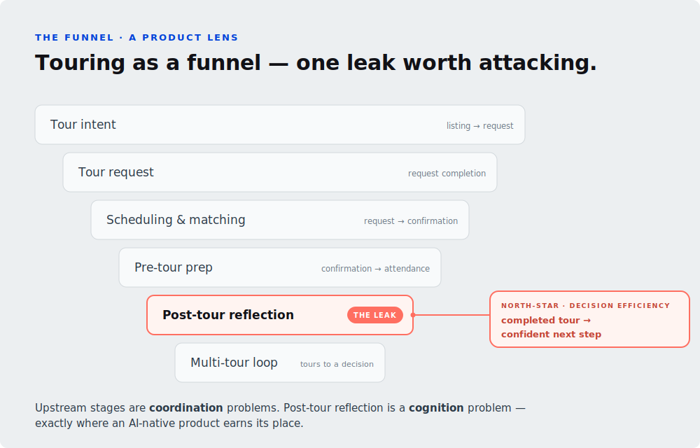

# Tour Debrief Companion — Solution Document

An AI-native mobile prototype for the moment right after a home tour. This document is
self-contained: it states the problem, the proposed solution, the core technical design
(a deterministic comparison system and a small, constrained agent), and the order in
which we build it.

---

## 1. Problem

A home buyer tours **~8 homes** before they transact — roughly how long reaching a
confident decision takes today. For any real-estate platform, brokerage, or agent, each
in-person tour is costly (agent time, coordination, scheduling), and the business wins
on *conversion and revenue per transaction*, not on raw tour volume. So the opportunity
is **decision efficiency**: getting the buyer to a confident next step in fewer tours.

The block is **cognitive**. At the end of a tour (post-tour reflection), impressions are
unstructured and emotional, and they fade within days — so the buyer stalls instead of
progressing. Most funnel stages are **coordination** problems (booking, scheduling);
this one is a **cognition** problem, and that is where an AI-native product earns its
place.

**North-star — decision efficiency.** Once a tour ends, the buyer gets cognitive support
for the next decision — a confident *progression*: making an offer, booking a second
visit, booking a tour on a different home, or confidently ruling a home out.

## 2. Solution

A voice-first iOS app that turns a 30-second post-tour reaction into **memory,
explainable comparison, and a next step**.

**The loop we are building (and what the demo shows):**

1. **Onboarding** — the buyer starts by stating their preferences.
2. **Voice debrief** — after a tour, the buyer records a 20–30s impression.
3. **Buyer memory** — extraction proposes preference/perception updates; each is shown to the buyer, and only what they accept is committed.
4. **Explainable comparison** — toured homes re-rank against current memory; the order is explained, not just listed.
5. **Next best action** — one grounded suggestion (book again, ask the agent, plan the route).

## 3. Core technicalities

For this prototype we focus on two core components that make this an *AI-native* feature
whose outputs we can track and explain.

### Comparison system

For purposes of the demo, we simulate a comparison system to score a house. The
comparison system turns the buyer's preferences into a **ranked, explainable ordering of
toured homes**, recomputed every time a debrief shifts those preferences. It's a pure,
deterministic function — so the LLM never decides the order. We build a harness around
it, provisioning an agent with the required tools to interact with this system.

The metric our system produces is the `fit`: it lets us rank each house based on the
buyer's preferences.

Each buyer has a set of preferences; to characterize each, we need just two components:
**Direction** and **Magnitude**. Direction is simple — whether a buyer wants more or
less of something: a big yard, or less of it for minimal upkeep. Magnitude is the
importance the buyer grants to that dimension — low (minor), medium (nice-to-have), or
high (must-have); the number of rooms might be a minor inconvenience for one buyer and a
deal-breaker for another. On the home side there's just a **rating, 0–100 per dimension**
— the *amount* of the trait, where higher means more (more yard, shorter commute,
quieter) — drawn from a closed vocabulary:
`yard · commute · quiet · kitchen · light · parking · budget · note`.

Now we can compute the fit.

**Step 1 — calculate the `match`.**
The rating says how *much* of a trait a home has; `match` says how *desirable* that is to
this buyer. If they **want more**, the match is the rating itself; if they **want less**,
we mirror it (`100 − rating`):

$$
\text{match} =
\begin{cases}
\text{rating} & \text{if } \mathsf{wantsMore} \\
100 - \text{rating} & \text{if } \mathsf{wantsLess}
\end{cases}
\qquad (\text{per preference},\ 0\text{–}100)
$$

E.g. a home's yard rating is `0` (no yard): a buyer who *wants* a yard scores
`match = 0`; one who *wants less* yard scores `match = 100 − 0 = 100`. Same home,
opposite satisfaction.

**Step 2 — calculate the `fit`.**
A home's overall fit is the **magnitude-weighted average** of its matches across every
preference — each match counts in proportion to its weight `w_p` (high 3 · medium 2 ·
low 1):

$$
\text{fit}\% \;=\; \frac{\sum_p\, w_p \times \text{match}_p}{\sum_p\, w_p}
\qquad \text{over the buyer's preferences } p
$$

This is a basic system, but it gives us traceability — a foundation for further
improvements.

### A small, constrained, and observable agent harness

An **on-device mini ReAct agent harness**. We keep the ReAct loop intact (thought ·
action · observation · trajectory · reasoner · tool) but point it at two narrow jobs in
the prototype instead of letting it roam free:

- **Extraction** — turn a voice transcript into structured observations (positives, concerns, preference updates). The agent acts only through a small, fixed set of tools, and **every change it proposes becomes a confirmation card the buyer approves before anything touches memory** — the human-in-the-loop step that absorbs the LLM's variability.
- **Comparison aid (gather → emit)** — gather the buyer's memory and the current ranking, then explain the order and suggest a next step. The agent **reads the deterministic `fit` scores and can never contradict them**: it narrates the ranking, it doesn't decide it.

Two properties keep it trustworthy: it's **bounded** (a fixed tool palette and a tight
step budget — no open-ended autonomy) and **observable** (each step emits an event, so
the whole reasoning trail is inspectable).

## 4. Build order

This is a clean rebuild. Each item below is an independent branch / PR — the **ID**
prefixes the branch name (e.g. `backend/listings`). Engineering design is done per task;
this list only fixes the **order** we attack them in.

**Phase 1 — Foundations** (plumbing & components, buildable in parallel)

1. `backend/listings` — **Backend & mock listings**: stand up Supabase under a `backend/` dir; seed a set of mock house listings. All backend work is enclosed here.
2. `feat/comparison-core` — **Comparison system**: the deterministic `fit` engine (§3); compute buyer↔home fits standalone, with a CLI for integration tests — green before anything depends on it.
3. `feat/voice-extraction` — **Voice extraction**: on-device transcription → structured-extraction component (no UI yet).
4. `feat/logging` — **Logging & events**: the event/log system the rest of the app emits into.
5. `ui/app-shell` — **UI/UX shell**: the empty screen flow with all shared pieces ready — navigation, design tokens/palette, Developer Views. No functionality yet.

**Phase 2 — UX screens** (each built independently, no agentic features)

6. `feat/per-home-debrief` — **Per-home debrief**: attribute impressions to the selected home (per-home impression streams).
7. `feat/buyer-memory-panel` — **Buyer-memory panel**: memory browser + recurrence stats ("mentioned at 3/3 homes → promote").
8. `feat/plan-tab` — **Plan tab**: next-best-actions wired to real data + the in-app event log.
9. `feat/tour-state` — **Tour-state advancement**: move homes `notToured → booked → debriefed` so any home can enter Compare on cue.

**Phase 3 — Agentic layer** (the ReAct harness, last)

10. `agent/react-loop` — **ReAct extraction loop**: build the mini ReAct harness (§3) and route extraction (voice → confirmation cards) through it.
11. `agent/compare-aid` — **Compare gather→emit agent**: replace the deterministic narrator with the gather→emit agent.
